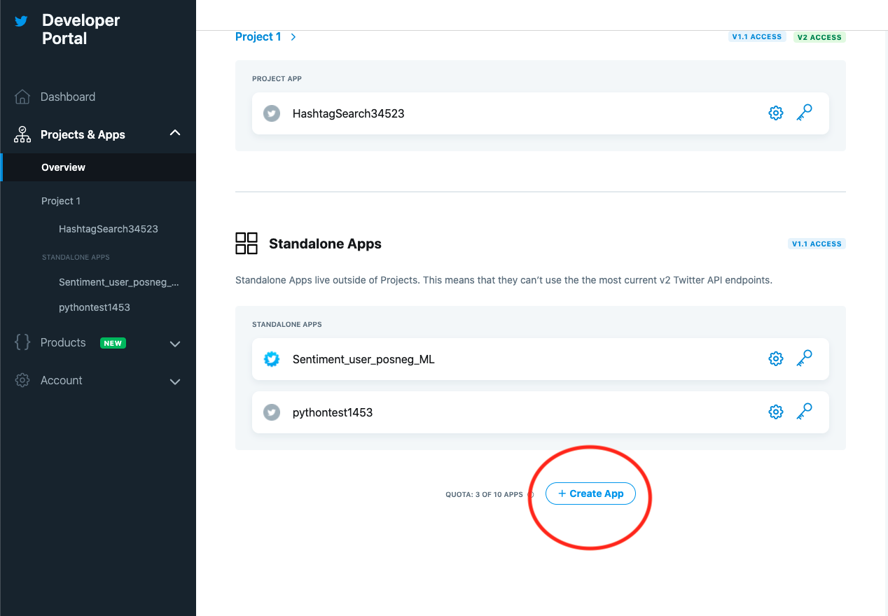

## Twitter Streaming Project :duck: :robot:

This project is a web crawler that allows you to set up a bot that will continually listen to Twitter for a particular trend or phrase that is input by the user. It uses the Tweepy library to connect with Twitter from Python.

__See this project live in Repl at__ https://repl.it/@jessdam/twitter-streamer

##
#### Editing the project
_Note: to edit this project in the online environment you'll need a Repl, Google, Facebook or GitHub account_

After clicking on the link above, click on the `Fork` button at the top of the page, which will make a copy of the project for you to edit, as shown below:

##
#### Setting Up Twitter Developer Access
To be able to get this project connected, you'll need to create a Twitter account if you don't have one, to be able to connect it to the developer app - this helps Twitter know that the app isn't being used for anything malicous.

After connecting to the developer app, create an app from the `Overview` page to be able to generate the keys and tokens you'll be using to login via your Python code.

Enter your keys and tokens into the `twitter.conf` file to start using the project

__keep your keys safe and do not share with other people__

See more here: https://developer.twitter.com/en/apply-for-access
##

- Tweepy library Documentation https://docs.tweepy.org/en/latest/
- This project was inspired by https://realpython.com/twitter-bot-python-tweepy/

