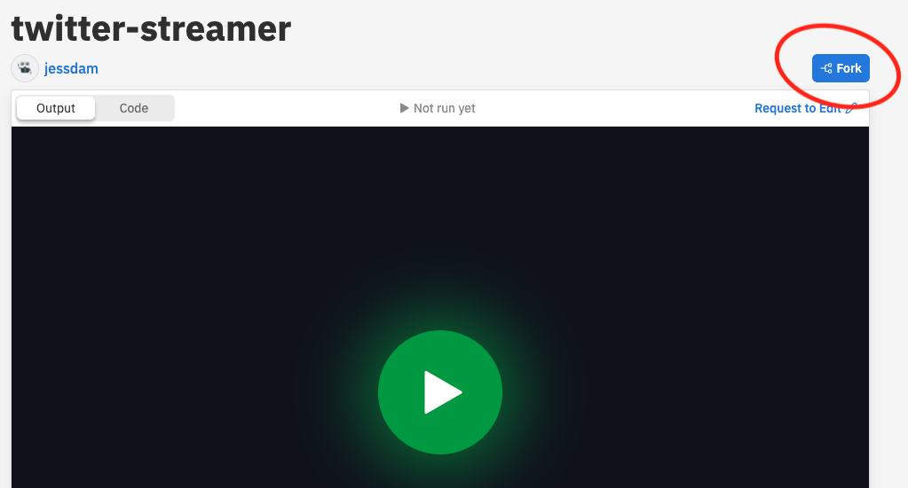

## Twitter Streaming Project :duck: :robot:

This project is a web crawler that allows you to set up a bot that will continually listen to Twitter for a particular trend or phrase that is input by the user. It uses the Tweepy library to connect with Twitter from Python.

__See this project live at__ https://repl.it/@jessdam/twitter-streamer

##
#### Editing the project
_Note: to edit this project in the online environment you'll need a Repl, Google, Facebook or GitHub account_

After clicking on the link above, click on the `Fork` button at the top of the page, which will make a copy of the project for you to edit

##

- Tweepy library Documentation https://docs.tweepy.org/en/latest/
- Project was inspired by https://realpython.com/twitter-bot-python-tweepy/

